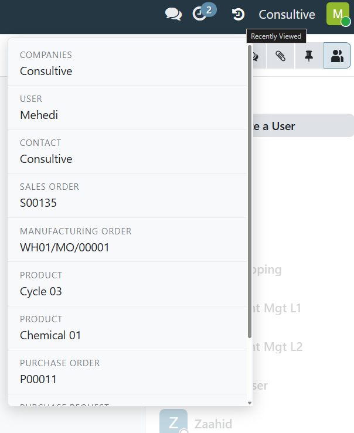

# Recently Viewed Records — Odoo 19.0

A lightweight systray history widget for Odoo. Every time you open a form view, the module records it. Click the history icon in the top bar to see a dropdown of your last 20 visited records — across all models — and jump straight back to any of them.

---

## Features

- **Last 20 records per user**, across every model in Odoo
- **Systray icon** — always one click away, never in the way
- **Upsert logic** — re-opening a record moves it to the top, no duplicates
- **Server-side storage** — history follows you across devices and browsers
- **Per-user isolation** — enforced via Odoo record rules
- **Deleted record handling** — shows the stored name rather than breaking
- **Zero performance overhead** — fire-and-forget async logging

---

## Installation

1. Copy the `consultive_recently_viewed_basic` folder into your Odoo addons path.
2. Restart Odoo.
3. In **Apps**, search for "Recently Viewed Records" and click **Install**.
4. Open any record — the history icon appears in the systray immediately.

---

## Compatibility

| Field       | Value           |
|-------------|-----------------|
| Odoo        | 19.0            |
| Depends on  | `web`           |
| License     | LGPL-3          |
| Author      | Consultive      |
| Price       | Free            |

---

## Support

- Website: [consultive.io](https://consultive.io)
- Email: [contact@consultive.io](mailto:contact@consultive.io)

For bugs or feature requests, open an issue on the GitHub repository or email us directly.
